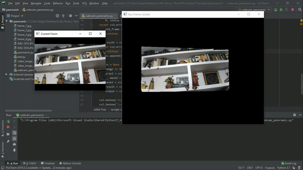

# Real-Time-Panoramic-Image
Using OpenCV, SIFT, and RANSAC algorithm from a webcam you can extend the image in all directions.

Continuing with OpenCV and keypoints. I've recently learned the RANSAC algorithm (https://es.wikipedia.org/wiki/RANSAC) in the search of making a camara stabilization algorithm.
In this algorithm, the first frame of a video (webcam) is keypointed using SIFT and the next frame gives you the perspective transformation matrix. You draw them in masks so you can "paste" them one in front of the other, wich sadly was took the longest thing to figure out, please tell me if another more stright forward method is known.

Pretty cool project. The results are pretty amazing, I think. Took effort but I'm happy with the results.

